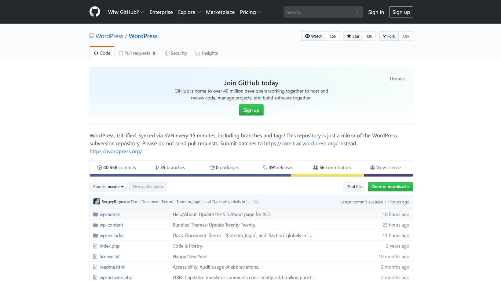

# Conceptos básicos de Github.
### Qué es Github.
---

Github es un portal creado para alojar el código de las aplicaciones de cualquier desarrollador, y que fue comprada por Microsoft en junio del 2018. La plataforma está creada para que los desarrolladores suban el código de sus aplicaciones y herramientas, y que como usuario no sólo puedas descargarte la aplicación, sino también entrar a su perfil para leer sobre ella o colaborar con su desarrollo.

La web utiliza el sistema de control de versiones Git diseñado por Linus Torvalds. Un sistema de gestión de versiones es ese con el que los desarrolladores pueden administrar su proyecto, ordenando el código de cada una de las nuevas versiones que sacan de sus aplicaciones para evitar confusiones. Así, al tener copias de cada una de las versiones de su aplicación, no se perderán los estados anteriores cuando se va a actualizar.

Así pues, Git es uno de estos sistemas de control, que permite comparar el código de un archivo para ver las diferencias entre las versiones, restaurar versiones antiguas si algo sale mal, y fusionar los cambios de distintas versiones. También permite trabajar con distintas ramas de un proyecto, como la de desarrollo para meter nuevas funciones al programa o la de producción para depurar los bugs.

Las principales características de la plataforma es que ofrece las mejores características de este tipo de servicios sin perder la simplicidad, y es una de las más utilizadas del mundo por los desarrolladores. Es multiplataforma, y tiene multitud de interfaces de usuario.

Así pues, Github es un portal para gestionar las aplicaciones que utilizan el sistema Git. Además de permitirte mirar el código y descargarte las diferentes versiones de una aplicación, la plataforma también hace las veces de red social conectando desarrolladores con usuarios para que estos puedan colaborar mejorando la aplicación.

---
### Qué ofrece Github
---

Github permite que los desarrolladores alojen proyectos creando repositorios de forma gratuita. Pero hay que tener una cosa en mente, y es que para poder subir gratis los proyectos deberán ser de código abierto. Y no quieres que tu aplicación sea de código abierto, la plataforma también tiene una versión de pago para alojar proyectos de forma privada.

Como te hemos mencionado más arriba, en Github también puedes entrar a los proyectos de los demás y colaborar para mejorarlos. Esto quiere decir que los usuarios pueden opinar, dejar sus comentarios sobre el código, colaborar y contribuir mejorando el código. También pueden reportar errores para que los desarrolladores lo mejoren.

Github también ofrece una serie de herramientas propias con las que complementar las ventajas que ya tiene el sistema Git de por sí solo. Por ejemplo, puedes crear una Wiki para cada proyecto, de forma que puedas ofrecer toda la información sobre él y anotar todos los cambios de las diferentes versiones.

También tiene un sistema de seguimiento de problemas, para que otras personas puedan hacer mejoras, sugerencias y optimizaciones en los proyectos. Ofrece también una herramienta de revisión de código, de forma que no sólo se pueda mirar el código fuente de una herramienta, sino que también se pueden dejar anotaciones para que su creador o tú mismo después si es tu proyecto las podáis revisar. Se pueden crear discusiones también alrededor de estas anotaciones para mejorar y optimizar el código.

A su vez, se pueden encontrar gráficos para ver cómo trabajan los desarrolladores en sus proyectos y bifurcaciones del proyecto, viendo las actualizaciones realizadas a partir de la primera versión o los cambios que se han realizado. Y por último también se incluyen características de redes sociales, como un sistema para seguir a tus creadores favoritos y ni perderte sus actualizaciones.