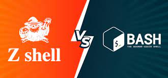

# Conceptos básicos de comandos de la terminal.
### Qué es una terminal.
---
La terminal o consola es una forma generalizada de llamar a la interfaz de usuario de línea de comandos: una pantalla (generalmente, de color de fondo negro sobre letras blancas) donde escribiendo comandos (secuencias de palabras especiales) ordenamos al sistema realizar acciones concretas.

Estas interfaces de usuario fueron muy populares en la década de los 70 y 80, ya que los sistemas de la época carecían de interfaces gráficas y era el sistema habitual para comunicarse con un dispositivo. Con el tiempo, las interfaces gráficas de usuario ganaron popularidad y relegaron a las interfaces de línea de comandos a un segundo plano, aunque nunca terminaron de perder la popularidad que las caracterizaba, sobre todo entre los usuarios más técnicos.

Aunque una interfaz gráfica de usuario (GUI) puede ser más cómoda y agradable para el usuario, las razones para preferir una interfaz de línea de comandos son muchas:

* Es más rápido crear un programa para línea de comandos.
* Suele ser más potente en cuanto a personalización de opciones.
* Permite creación de scripts para automatizar tareas repetitivas.
* Suele ser una opción más universal entre sistemas.
* Suele ser instantáneo, al no tener que cargar pantallas gráficas.

Es por ello que en el mundo de la informática, y del desarrollo en particular, es una vertiente muy utilizada aún en nuestros días, que no suele ser comprendida por personas externas al sector, que lo consideran un «atraso» al no conocer sus ventajas y sólo conocer sus desventajas.

No obstante, el panorama de línea de comandos ha mejorado muchísimo desde estas primeras décadas y hoy en día existen multitud de opciones para convertir una terminal en una herramienta de trabajo muy productiva, que será nada menos que nuestro objetivo.

---
### Conceptos básicos.
---
Hasta ahora, para simplificar, hemos utilizado una gran cantidad de términos que no son exactamente lo que parecen, por lo que antes de continuar, vamos a dedicar unos minutos a explicarlos, ya que los utilizaremos bastante:
* Interfaz de usuario es un medio (genérico) por el cuál se comunica un usuario y una máquina. Abreviada UI.

* Interfaz de línea de comandos es unai nterfaz de usuario (UI) basada en texto. Abreviada como CLI.

* Interfaz gráfica de usuario	es una interfaz de usuario (UI) basado en paneles gráficos o táctiles. Abreviada como GUI.

* Interprete de comandos es el software encargado de gestionar los comandos del usuario y sus respuestas. Se suele abreviar como Shell.

* Terminal o Consola es el dispositivo utilizado antiguamente para comunicarse con un sistema.

* Emulador de terminal es el software que simula ser una terminal, generalmente una ventana donde hay una interfaz CLI.

* Comando	es cada una de las instrucciones que escribimos en una interfaz CLI para comunicarnos.

* Parámetro	son las diferentes opciones que puede tomar un comando para alterar su funcionamiento.

* Script	es un grupo de comandos, creado con la intención de automatizar tareas.

Una interfaz de usuario (UI) es como se denomina al medio que utiliza un usuario para comunicarse con una máquina. En nuestro caso nos vamos a referir a interfaces de línea de comandos (CLI) cuando son basadas en texto, donde los usuarios escriben órdenes o comandos y el sistema las lee y realiza, o devuelve resultados e información.

Por otra parte, las interfaces gráficas de usuario (GUI) son la evolución natural de estas, utilizando pantallas gráficas o sistemas táctiles, mucho más sencillos y agradables de utilizar para la mayoría de los usuarios, sin embargo, habitualmente menos apropiadas y flexibles en contextos informáticos de desarrollo o sistemas.

Además, también hay que aclarar el concepto de intérprete de comandos (shell). Se trata del software que tiene instalado el sistema y que utilizamos en la interfaz de línea de comandos. Por ejemplo, una interfaz de línea de comandos puede utilizar varios intérpretes diferentes, como por ejemplo, suele ocurrir con Bash o Zsh en GNU/Linux.

Es también muy frecuente utilizar la palabra terminal (en esta misma página lo hago frecuentemente) en lugar de emulador de terminal. Se hace para acortar, porque en realidad una terminal es un aparato que antiguamente se utilizaba para comunicarse con otro sistema, mientras que un emulador de terminal, que es lo que realmente utilizamos en nuestros dispositivos, es un software que simula ser una de esas terminales, habitualmente con apariencia de ventana de línea de comandos, aunque se puede encontrar de todo.

Solemos utilizar la palabra comando para referirnos a la instrucción que escribimos en el emulador de terminal para comunicarnos con el sistema, mientras que opciones o parámetros son los detalles que se suelen escribir a continuación para personalizar la forma de trabajar del comando o alterar su funcionamiento.

Por último, también es muy común crear scripts, que no son más que ficheros de texto donde se escriben una colección de comandos para realizar una tarea concreta, con la intención de automatizarla y sea mucho más fácil para nosotros realizarla, ya que en lugar de escribir todos esos comandos por separado, sólo tenemos que llamar a ese script.

